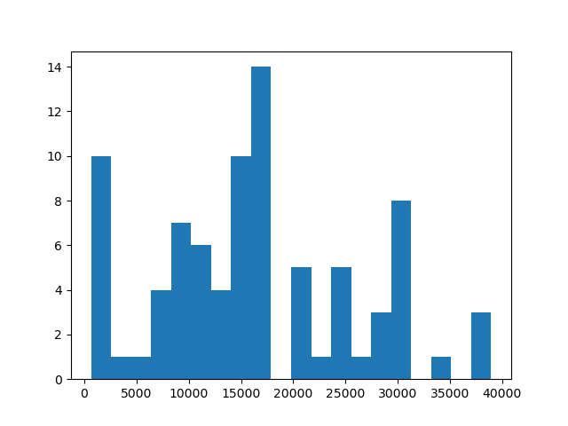

# Corpus de documentation technique

## Description générale
Ce corpus vise à rassembler des textes de documentation technique afin d'estimer les performances des modèles de traitement automatique des langues sur ce genre de littérature.

Les textes ont été récupérés automatiquement sur le site de [Notice Facile](https://www.notice-facile.com) qui répertorie des documentations constructeurs pour 220 marques.

84 notices d'utilisations ont été récupérée pour des outils de 6 marques différentes : AASTRA, ABC, ABB, SAMSUNG, A-ONE et ABIT.

Les notices récupérées sont en français.

Les textes issus de documentation technique comportent un intérêt particulier de par leur spécificité de langage qui regroupe acronyme, anglicisme et termes techniques.

## Pipeline de traitement

Les textes ont été récupérés sous formes de pdf depuis le site [Notice Facile](https://www.notice-facile.com) grâce au script `crawl_notice.py` puis le textes de ces documents a été extrait à l'aide de la bibliothèque pdfminer avec le script `pdf2text.py` afin de former un corpus exploitable de 84 documents.

Les statistiques de corpus exposée ci-après ont été calculée par le script `exploit_text.py`.

## Statistiques de Corpus

|| nb de mots | nb de phrases | nb de tokens |
|:--:| :---------:|:----------:|:--------------:|
|moyenne| 16177 | 4362 |NC|
|mediane| 15925 | 2242 | NC|

